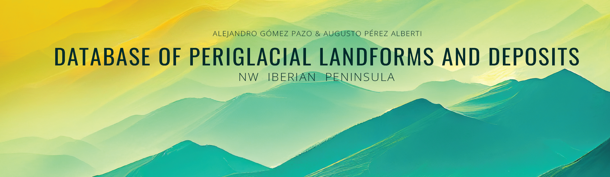

  

**Current version: 1.0.0:** Version updated at 31/05/2023.

----

**Contents:**

* [**Aim of this dataset**](#aim-of-this-dataset)
* [**Dataset information**](#dataset-information)
  * [**Structure**](#structure)
  * [**Data source**](#data-source)
* [**Contributions**](#contributions)
* [**Dataset citation**](#dataset-citation)
* [**Authors**](#authors)
* [**References**](#references)

----

## **Aim of this dataset**

This project is the first approach for creating a database on periglacial geoforms present in the NW of the Iberian Peninsula. The database has been created as a reference element to carry out paleoenvironmental reconstructions that help precisely characterize the forms. This could improve the interpretation of the current landscape and the territorial evolution. For this reason, the files include not only alphanumeric data, but each record was also created with maps and images that clearly understand each site and, where appropriate, the previous works about these areas. Another key aim of this project is to determine the importance of each site at the local, regional, or international level. This fact aims to propose some specific areas as sites of geological interest, thus preventing their disappearance.

## **Dataset information**

### **Structure**

The original shapefile/kml contains the following information, the final text in ***bold italic*** indicates the variable name on the table:

1. **Name**: Denomination of periglacial geoform based on their location or the main closet features (peaks, rivers...). ***Name***
2. **Municipality**: First administrative level in the database area. ***Munic***
3. **Region**: This field includes the Autonomous Communities to improve future works. ***Region***
4. **Type of geoform**: Different categories as: block stream, blockfield, rock glacier, and stratified slope deposits. ***Form_type***
5. **X coordinate (º)**: Longitude of the geoform centroid based on their recognizable surface. ***X***
6. **Y coordinate (º)**: Latitude of the geoform centroid based on their recognizable surface. ***Y***
7. **Elevation (m)**: Elevation of the geoform centroid based on their recognizable surface. ***Elevation***
8. **Slope (º)**: Mean slope using the entire mapped surface of each geoform. ***Slope***
9. **Aspect (º)**: Mean aspect using the entire mapped surface of each geoform. ***Aspect***
10. **Minimum Elevation (m)**: Minimum elevation on the geoform surface. ***Min_Elev***
11. **Maximum Elevation (m)**: Maximum elevation on the geoform surface. ***Max_Elev***
12. **Surface (ha)**: Area occupied by the geoform based on photo interpretation and fieldwork data in some cases. ***Surface***
13. **Sedimentary composition**: Based on sedimentary composition analysis (e.g., on stratified slope deposits). ***Sed_car***
14. **Dating**: Age of geoform when this information is available. ***Dating***
15. **Dating method**: Technique to obtain the datation. ***Method_dat***
16. **Dating information**: Table, graphics, or other material about the dating samples and the obtained values. ***Dat_info***
17. **Photographs/Video**: Name of the supplementary information, where it is available, as photographs or videos. ***Multim***
18. **Related papers**: Research where appear information about the geoform. ***Papers***
19. **Other information**: Other relevant information about the geoform. ***Other_info***
20. **Last update**: Date of the last modification. ***L_Update***

### **Data source**

- The coordinate system of this dataset is: WGS84.
- Format: shapefile and kml.
- Data type: points.
- Number of records: 180.
- Stratified slope deposits do not contain the information about the minimum and maximum elevation and their surface. The current status of these areas do not allow a accuracy analysis about their extension.
- All references related with the recorded geoforms are included in the [.bib file](https://github.com/alejandro-gomez/periglacial-database-NW-Iberia/blob/main/references/references.bib), in folder "references".

## **Contributions**

Do you have information about the location of some periglacial geoforms and can include the information on this database? Please feel free to contact with Alejandro Gómez-Pazo on a.gomez@usc.es

## **Dataset citation**

Using this dataset for research publication? Please **cite it**!

***Gómez-Pazo, A. & Pérez-Alberti, A.***, (*2023*). *Database of periglacial landforms and deposits in the NW Iberian Peninsula*. 6th European Conference on Permafrost (EUCOP 2023). Puigcerdà. pp.437. DOI: [https://doi.org/10.52381/EUCOP6.abstracts.1](https://doi.org/10.52381/EUCOP6.abstracts.1)

## **Authors**

Alejandro Gómez-Pazo . PosDoc researcher at University of Santiago de Compostela. a.gomez@usc.es

Augusto Pérez-Alberti . Ad Honorem Prof. at University of Santiago de Compostela. augusto.perez@usc.es

## **References**

- Gómez-Pazo, A. & Pérez-Alberti, A. (2023). Database of periglacial landforms and deposits in the NW Iberian Peninsula. 6th European Conference on Permafrost (EUCOP 2023). Puigcerdà.pp.437. DOI: [https://doi.org/10.52381/EUCOP6.abstracts.1](https://doi.org/10.52381/EUCOP6.abstracts.1)

